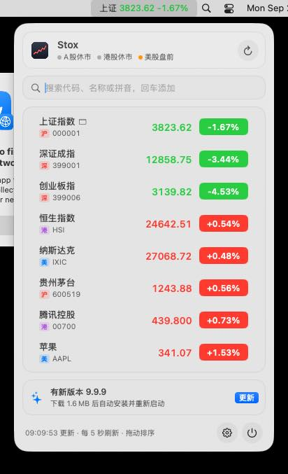

# Stox

一个轻量的 macOS 菜单栏股票行情工具。左键点一下菜单栏图标打开玻璃质感的行情面板，再点一下（或点面板外、按 Esc）就关掉；右键点一下在“显示行情”和“只显示图标”之间切换。原生 Swift 编写，压缩包约 3MB，内存占用约 28MB。

<p>
  
  
</p>
<p>
  
  
</p>
<p>
  
  
</p>
<p>
  
</p>
<p>
  
</p>

截图依次是自选列表、展开详情（分时和均价线）、日 K 和均线、A 股的买卖五档、持仓与盈亏、搜索添加、“不显示红绿”配色和设置窗口，由 CI 在 macOS 15 上启动打包好的 App 自动截取，数据是 2026-09-28、29 的实时行情。

## 功能

- **一键开关**：左键单击菜单栏图标打开 / 关闭面板；点面板外或按 Esc 也会关闭；全局快捷键在任何 App 里都能呼出，默认 ⌃⌥S，可以在设置里改成别的组合。
- **一键隐藏**：右键单击菜单栏图标，在“显示行情”和“只显示图标”之间切换，不想被别人看到行情时点一下就行。
- **钉住成悬浮窗**：点面板右上角的图钉，面板就一直显示，点别处也不关，可以拖到屏幕上任何位置，下次打开还在那里。
- **菜单栏行情**：把任意几只股票“显示在菜单栏”，等宽数字不跳动；多只时可以轮播，适合刘海屏；也可以设成休市时只显示图标。
- **涨跌颜色**：红涨绿跌、绿涨红跌，或者“不显示红绿”，全部用系统默认的文字颜色，低调不显眼。面板可以单独设成浅色或深色。
- **玻璃风格**：面板和设置窗口透出后面的桌面，和 [ProxySwitch for Mac](https://github.com/whrss9527/proxyswitch-mac) 保持一致；用 Xcode 26 编译、运行在 macOS 26 上时使用系统的 Liquid Glass。
- **iCloud 同步和备份**：自选、每只的提醒和简称、刷新和颜色这些设置，通过 iCloud 云盘在多台 Mac 之间同步；不开 iCloud 也可以导出成文件备份，再在另一台 Mac 上导入。
- **检查更新、一键更新**：发现新版本时面板底部出现“更新”按钮，点一下自动下载、校验、替换并重新启动。
- **覆盖三地市场**：沪深北 A 股、港股、美股，以及上证指数、恒生指数、纳斯达克等指数和 ETF；美股个股在盘前盘后显示盘前盘后价（设置里可以关掉）。
- **搜索添加**：输入代码、中文名或拼音首字母（`600519`、`腾讯`、`gzmt`、`aapl`），搜索结果直接带着现价和涨跌幅，回车添加第一条；一次粘贴多个代码（`600519 00700 AAPL`）可以批量添加。底部的排序菜单里能一键复制全部代码，粘贴到另一台 Mac 的搜索框就能全部加回来；也能复制持仓表格和买卖记录，直接粘贴到 Numbers、Excel。
- **自选管理**：拖动排序（只看某个分组时也能拖），或者按涨幅、跌幅排序；可以给自选分组（右键选“分组”），列表上方可以只看某个分组、A 股、港股、美股或者有持仓的；自选多时可以切成每只一行的紧凑列表；点右边的色块在涨跌幅、涨跌额、总市值之间切换；价格变动时轻轻闪一下；单击展开详情，看今开、最高、最低、成交额、换手率、市盈率、市值、52 周最高最低；右键可固定到菜单栏、设置持仓和提醒、在雪球查看、删除。
- **分时和 K 线**：展开后可以在分时、五日、日 K、周 K、月 K 之间切换，K 线是前复权的最近 60 根，带 5、10、20 根的均线和成交量，个股的分时图、五日图上有均价线，图下面标着时间或日期；鼠标移到图上显示那一分钟的价格和均价，或那一根的开高低收、成交量和均线值。A 股个股还可以切到“五档”，看买一到买五、卖一到卖五的挂单，以及委比、委差和外盘内盘。填了持仓的在图上画成本线，K 线上用 B、S 标出记过的买卖。
- **键盘操作**：↑ ↓ 在搜索结果或自选里选择，回车添加或展开，展开后 ← → 切换分时和 K 线，配合全局快捷键可以完全不碰鼠标。
- **持仓与盈亏**：给每只填上持有数量和成本价，列表里显示持仓盈亏比例，展开后看持仓盈亏和今日盈亏，列表上方按人民币、港币、美元分别合计（只看某个分组或市场时只算这些），几种货币都有时再按汇率折成人民币合计一行，还可以展开看每只占总市值多少，以及最近每个交易日赚了多少（本周、本月合计）；也可以在菜单栏显示今日盈亏。买卖之后在编辑页“记一笔”，买入自动按加权平均重新算成本价，卖出记下这一笔赚了多少，分红送转也能记（成本价自动摊薄），合计卡片下面写着今年已实现的盈亏，今天的买卖也会算进今日盈亏；打开“收盘小结”后，有持仓的市场收盘时发一条今日盈亏通知。
- **备注**：给每只写一句备注，比如关注的理由，展开后显示，也跟着 iCloud 同步。
- **价格提醒**：价格高于 / 低于、涨幅 / 跌幅达到阈值时发系统通知；填了持仓的还能按持仓盈亏比例止盈止损；还可以打开 A 股涨停、跌停提醒，创 52 周新高、新低提醒和 5 分钟异动提醒。每个条件每个交易日最多提醒一次，点通知直接展开那一只；错过的通知可以在“最近的提醒”里翻看。
- **行情源自动切换**：腾讯的行情接口取不到时自动改用新浪财经的行情，恢复后自动切回，面板底部会标出“新浪行情”。
- **省电**：休市和午休时自动降到每分钟刷新一次，节假日根据行情时间自动识别；电脑睡眠时停止请求。
- **其他**：登录时自动启动；设置在独立的窗口里，从面板底部的齿轮按钮打开。

行情来自腾讯财经公开接口（取不到时用新浪财经），免费、无需注册和 API Key。港股行情延时约 15 分钟。数据仅供参考，不构成投资建议。

## 安装

需要 macOS 13 Ventura 或更新版本，Apple 芯片和 Intel 都支持。

### 方式一：下载构建好的 App

1. 在仓库的 [Releases](https://github.com/whrss9527/stox/releases) 页面下载最新版本的 `Stox.zip`。想试用未发布的最新代码，可以在 [Actions](https://github.com/whrss9527/stox/actions/workflows/build.yml) 页面最近一次成功的构建里下载 `Stox-app`。
2. 解压后把 `Stox.app` 拖进“应用程序”文件夹。
3. App 使用临时签名（没有 Apple 开发者证书），第一次打开会被系统拦截。任选一种方式放行：
   - 在终端执行 `xattr -dr com.apple.quarantine /Applications/Stox.app`，然后正常打开；
   - 或者先双击一次，再到“系统设置 → 隐私与安全性”里点“仍要打开”。
4. 以后的新版本不用再手动下载：Stox 每 6 小时检查一次，有新版本时点面板底部的“更新”即可，也可以在设置的“关于与更新”里手动检查。

从 0.1.0 升级到 0.2.0 需要手动下载一次，0.2.0 起支持一键更新。

### 方式二：从源码构建

需要 Xcode 16 或更新版本。

```bash
git clone https://github.com/whrss9527/stox.git
cd stox
make install      # 编译、打包成 Stox.app、复制到“应用程序”并启动
```

其他命令：

```bash
make run          # 只打包到 dist/Stox.app 并运行
make test         # 运行单元测试
UNIVERSAL=1 make app   # 打包 Apple 芯片 + Intel 通用版
```

本机编译的 App 不会被 Gatekeeper 拦截。

## 使用

| 操作 | 效果 |
|---|---|
| 左键单击菜单栏图标 | 打开 / 关闭面板 |
| 右键单击菜单栏图标（或 Control + 单击） | 菜单栏在“显示行情”和“只显示图标”之间切换 |
| ⌃⌥S（可在设置里改） | 在任何 App 里打开 / 关闭面板 |
| Esc | 清空搜索 → 返回列表 → 关闭面板 |
| 面板底部的齿轮 / 电源按钮 | 打开设置窗口 / 退出 Stox |
| 单击一行 | 展开 / 收起详情和走势图 |
| ↑ ↓ | 搜索时选择搜索结果，否则选择自选里的一行 |
| 回车 | 添加选中的搜索结果（没选时添加第一条）；展开 / 收起选中的一行 |
| ← → | 展开时切换分时、五日、日 K、周 K、月 K（A 股还有五档） |
| 拖动一行 | 调整顺序 |
| 右键单击一行 | 显示在菜单栏、持仓提醒与简称、在雪球查看、复制代码、删除 |
| 单击一行右边的色块 | 在涨跌幅、涨跌额、总市值之间切换 |
| 面板底部的排序按钮 | 自定义顺序、涨幅或跌幅从高到低、持仓盈亏从高到低，色块显示什么，复制代码、持仓表格和买卖记录，新建分组，最近的提醒 |
| ⌘R / ⌘, / ⌘Q | 面板打开时：刷新 / 设置 / 退出 |

搜索框也接受直接输入代码，多个代码用空格、逗号或换行分开时会列出来，回车后先查一次行情，把存在的代码一起加进自选：

| 输入 | 识别为 |
|---|---|
| `600519`、`sh600519`、`600519.SS` | 沪市 贵州茅台 |
| `000001`、`000001.SZ` | 深市 平安银行（上证指数请输入 `sh000001`） |
| `920819`、`bj920819` | 北交所 |
| `700`、`00700`、`0700.HK` | 港股 腾讯控股 |
| `hkHSI` | 恒生指数 |
| `AAPL`、`brk.b` | 美股 |
| `us.IXIC`、`us.DJI`、`us.INX` | 纳斯达克、道琼斯、标普 500 |

### iCloud 同步

在设置窗口的“iCloud 同步”页打开开关即可，需要这台 Mac 已经打开 iCloud 云盘。同步的是自选列表（顺序、菜单栏固定、简称、持仓、价格提醒、分组）和刷新间隔、菜单栏显示内容、涨跌颜色、提醒开关；“只显示图标”、面板外观、快捷键、登录时启动这些只和本机有关的设置不同步。

数据保存在 iCloud 云盘的 `Stox/sync.json` 里。另一台 Mac 第一次开启时，如果 iCloud 里已经有自选，可以选择用 iCloud 的、用本机的，或者把两边合并。之后任何一台的改动几秒内就会出现在其他 Mac 上；改完马上退出也不要紧，下次启动时会先把本机的改动写上去。多台 Mac 同步持仓时，请把它们都更新到 0.3.0 或更新版本，同步分组时都更新到 0.19.0 或更新版本，旧版本写入时会丢掉这些内容。

### 更新



每个版本改了什么见 [更新日志](CHANGELOG.md)。Stox 启动后和之后每 6 小时检查一次 [GitHub Releases](https://github.com/whrss9527/stox/releases)，发现新版本时发一条通知，面板底部出现“更新”按钮。点一下会下载 `Stox.zip`，用发布附带的 SHA-256 校验，确认是同一个 App 并且签名完整后替换程序并重新启动，自选和设置都会保留。从“下载”文件夹直接运行时，新版本会装进“应用程序”，旧的那份移到废纸篓。不想自动检查可以在“关于与更新”页关掉。

<br clear="right">

## 开发

```
Sources/
  StoxCore/   与界面无关的逻辑：代码解析、腾讯行情与搜索解析、交易时段、提醒、格式化、同步文件格式与合并规则、
              发布信息解析与安装位置判断（Linux 上也能编译测试）
  Stox/       菜单栏 App：NSStatusItem + 玻璃面板（NSPanel）+ SwiftUI，设置窗口、iCloud 同步、更新
  StoxCLI/    命令行调试工具 stox-cli
Tests/StoxCoreTests/   单元测试，使用真实接口返回作为样本
scripts/
  build-app.sh         编译并组装、签名 Stox.app
  make-icon.swift      生成 App 图标
  check-datasources.sh 打印行情接口的原始返回，排查格式变化
  ci-e2e.sh            CI 端到端测试：启动、截图、iCloud 同步、一键更新
```

用命令行检查数据源：

```bash
swift run stox-cli quote sh600519 700 AAPL us.IXIC
swift run stox-cli search 茅台
swift run stox-cli raw hk00700
swift run stox-cli kline usAAPL week      # 最近几根 K 线（day、week、month）
swift run stox-cli sina sh600519 700 AAPL # 备用的新浪行情
swift run stox-cli latest-release 0.1.0   # GitHub 上的最新发布，以及能不能一键更新
```

调试界面时，可以让 App 启动后直接打开面板或设置窗口，并在终端打印菜单栏文字和窗口位置：

```bash
dist/Stox.app/Contents/MacOS/Stox --show-panel                    # 自选列表
dist/Stox.app/Contents/MacOS/Stox --show-panel --expand sh600519  # 展开某只证券的详情
dist/Stox.app/Contents/MacOS/Stox --show-panel --search 腾讯       # 预填搜索词
dist/Stox.app/Contents/MacOS/Stox --show-settings display         # 设置窗口：general、display、sync、about
dist/Stox.app/Contents/MacOS/Stox --check-update --show-panel     # 先检查一次更新
```

测试同步和更新时可以用环境变量换掉真实的 iCloud 云盘和 GitHub：

| 环境变量 | 作用 |
|---|---|
| `STOX_SYNC_DIR=/tmp/fake-icloud` | 同步文件放在这个文件夹，而不是 iCloud 云盘/Stox |
| `STOX_UPDATE_URL=http://127.0.0.1:8765/latest.json` | 从这里读取“最新发布”，格式同 GitHub 的 releases 接口 |
| `STOX_TEST_TRANSLOCATED=1` | 当作从只读的临时位置运行，更新会装进“应用程序” |

CI 会在 macOS 上启动打包好的 App：打开面板、详情、搜索和设置窗口并截图；用假的 iCloud 云盘文件夹测试同步；用本地的假发布把程序真正更新到 9.9.9 并确认重新启动。

## 发布新版本

两种方式都会由 CI 编译通用版 App，并把 `Stox.zip`、校验文件 `SHA256SUMS.txt` 连同安装说明发布到 Releases。已安装的 Stox 会据此提示更新：

- 在 Actions 页面选择 build 工作流，点 Run workflow，填写版本号，例如 `v0.2.0`。CI 会在当前 `main` 上创建同名标签。
- 或者在本地推送一个 `v` 开头的标签：

```bash
git tag v0.2.0 && git push origin v0.2.0
```

设计取舍见 [docs/DESIGN.md](docs/DESIGN.md)。
