<div align="center">
  
  <h1>Stox</h1>
  <p><strong>一眼看盘，一键隐身</strong></p>
  <p>住在 macOS 菜单栏里的股票行情。原生 Swift，玻璃质感，开源免费。</p>
  <p>
    <a href="https://github.com/whrss9527/stox/releases/latest"></a>
    
    
    <a href="LICENSE"></a>
  </p>
  <p>
    <a href="https://github.com/whrss9527/stox/releases/latest"><b>下载</b></a> ·
    <a href="CHANGELOG.md">更新日志</a> ·
    <a href="docs/DESIGN.md">设计说明</a> ·
    <a href="README.md">English</a>
  </p>
</div>

### **Stox** /stɒks/

念起来就是 **stocks**。

把 **stocks** 六个字母压缩成四个，读音却几乎不变。

行情也一样，压缩成菜单栏里小小的一格：抬眼看一眼，就知道发生了什么；不想被打扰时，右键一点，只留下一个安静的图标。

**Stox** 就是把股票行情压缩到最小，但又始终触手可及。

<p align="center">
  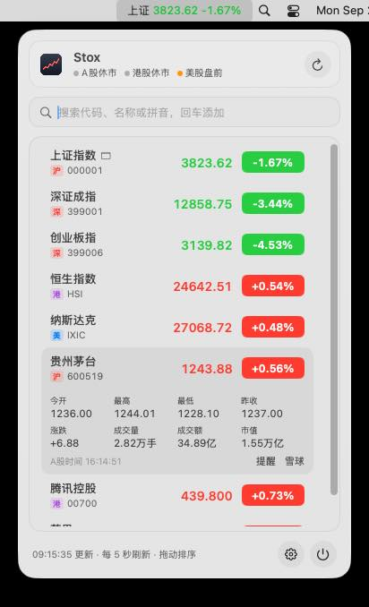
  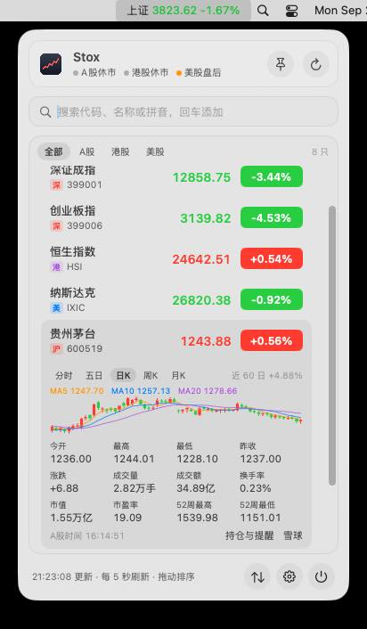
  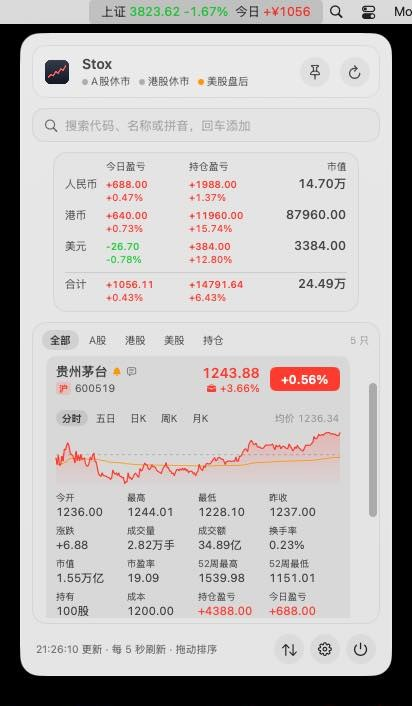
</p>

<details>
<summary><b>更多截图</b></summary>

<p>
  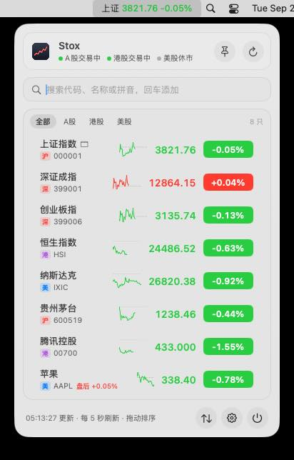
  
</p>
<p>
  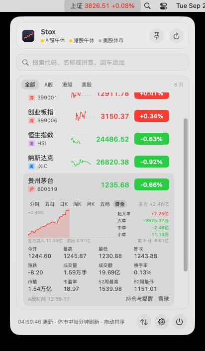
  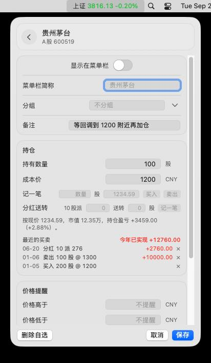
</p>
<p>
  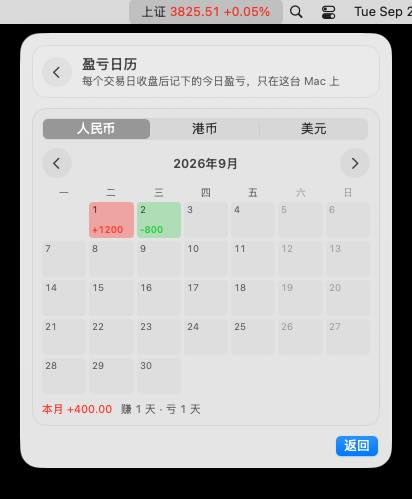
  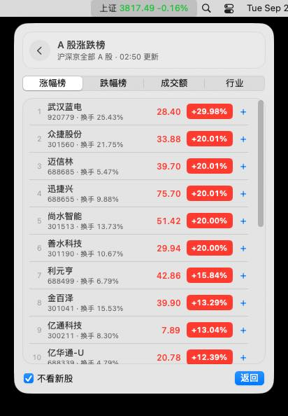
</p>
<p>
  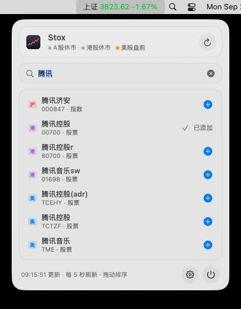
  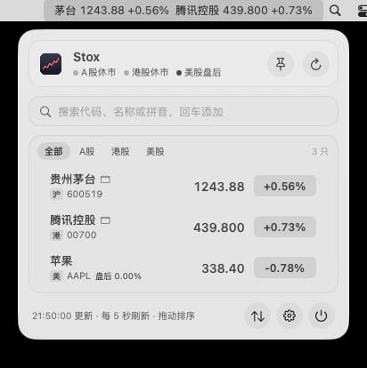
</p>
<p>
  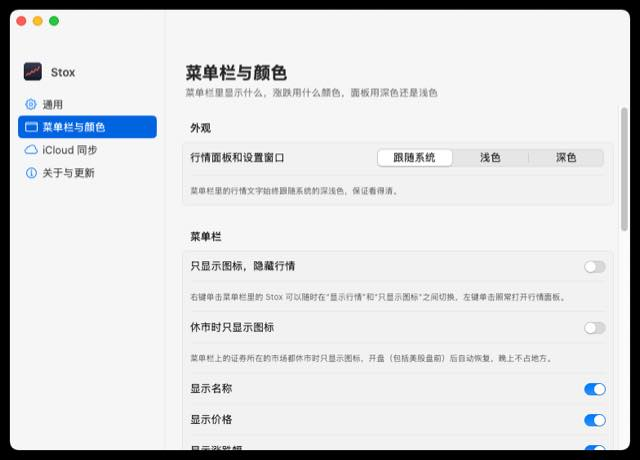
</p>

上面三张是展开详情（分时和均价线）、日 K 和均线、持仓与盈亏；这里依次是自选列表（每一行带着当天的迷你分时）、A 股的买卖五档、A 股的资金流向、编辑页的持仓和买卖记录、盈亏日历、A 股涨跌榜、搜索添加、“不显示红绿”配色和设置窗口。截图由 CI 在 macOS 15 上启动打包好的 App 自动截取，数据是 2026-09-28、29 的实时行情。

</details>

## 特性

- **一眼看盘**：左键点一下菜单栏图标，玻璃面板就出来；再点一下、点别处或按 Esc 就收起。
- **一键隐身**：右键点一下，菜单栏只剩个图标，旁边有人也不怕。
- **三地行情都有**：A 股、港股、美股，外加指数、ETF、场外基金、日经225、富时100、德国DAX 等环球股指、国际期货和外汇；分时、K 线、五档、资金流向都能看。
- **持仓和盈亏**：填上持仓，今日盈亏、持仓盈亏自动算好，还有盈亏日历。
- **该提醒时提醒**：到价、涨跌幅、止盈止损、涨停跌停、创新高新低，都会发通知。
- **轻**：压缩包约 3.6MB，内存约 30MB；不用注册，也不用 API Key。

## 安装

需要 macOS 13 Ventura 或更新版本，Apple 芯片和 Intel 都支持。

用 [Homebrew](https://brew.sh) 安装：

```sh
brew install --cask whrss9527/tap/stox
```

或者手动安装：

1. 在 [Releases](https://github.com/whrss9527/stox/releases) 下载最新的 `Stox.zip`，解压后把 `Stox.app` 拖进“应用程序”。
2. 双击打开。
3. 以后有新版本，点面板底部的“更新”就行。

更早的临时签名版本怎么放行、怎么从源码构建、GitHub 版和 App Store 版有什么不同，见[使用指南](docs/guide.zh-CN.md#安装)。

## 上手

| 操作 | 效果 |
|---|---|
| 左键单击菜单栏图标 | 打开 / 关闭面板 |
| 右键单击菜单栏图标（或 Control + 单击） | 菜单栏在“显示行情”和“只显示图标”之间切换 |
| ⌃⌥S（可在设置里改） | 在任何 App 里打开 / 关闭面板 |
| 单击一行 | 展开 / 收起详情和走势图 |
| ← → | 展开时切换分时、五日、日 K、周 K、月 K（A 股还有五档和资金） |
| 搜索框输入代码、中文名或拼音首字母 | `600519`、`腾讯`、`gzmt`、`aapl`，回车添加 |

## 文档

- [使用指南](docs/guide.zh-CN.md)：安装的几种方式、全部功能、全部操作和代码格式、iCloud 同步、更新
- [开发指南](docs/development.zh-CN.md)：目录结构、命令行调试、界面语言、发布新版本
- [设计说明](docs/DESIGN.md)、[App Store 版](docs/app-store.md)
- [更新日志](CHANGELOG.md)

## 支持

Stox 免费开源。觉得好用的话，点个 ⭐ Star 就是很大的鼓励；也可以微信扫一扫请我喝杯咖啡。

<p align="center"></p>

## 许可证

Copyright © 2026 whrss9527

Stox 是自由软件，以 [GNU 通用公共许可证第 3 版（GPL-3.0）](LICENSE) 发布：可以自由使用、研究、修改和分享；分发 Stox 或修改后的版本时，需要以同样的许可证提供源代码。

「Stox」这个名字和 Stox 的图标不在 GPL 授权范围内（GPL-3.0 第 7 条 e 项）。介绍 Stox、分享未经修改的副本时可以使用；分发修改后的版本时，请换用自己的名字和图标。

贡献需接受 [CONTRIBUTING.md](CONTRIBUTING.md) 里的贡献者协议。

---

<div align="center">
  <p><b>同样住在菜单栏里</b></p>
  <a href="https://github.com/whrss9527/pop"></a>
  <a href="https://github.com/whrss9527/meno"></a>
  <a href="https://github.com/whrss9527/proxi"></a>
</div>
